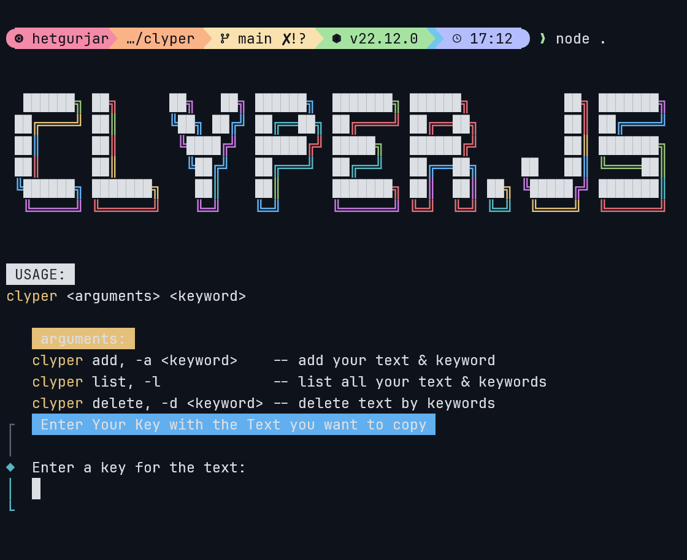

# Clyper.js an easy to use TUI/CLI clipboard tool

## Purpose

This is a tool created as a hobby project and personal use to simplify my day-to-day tasks within the terminal and store the repetitive & long commands as a short keyword by which i can copy the long-ass command directly onto my clipboard
